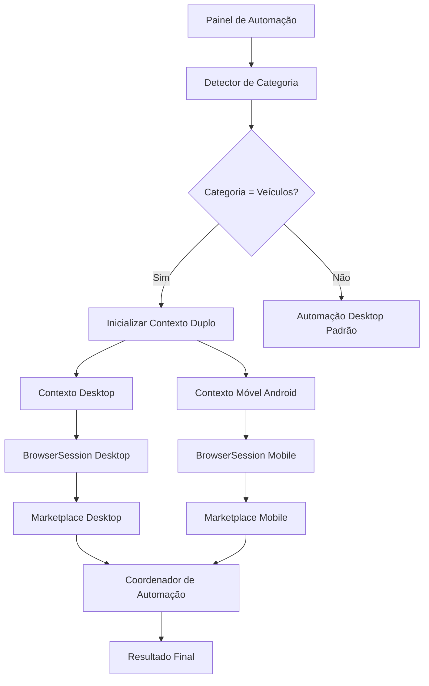
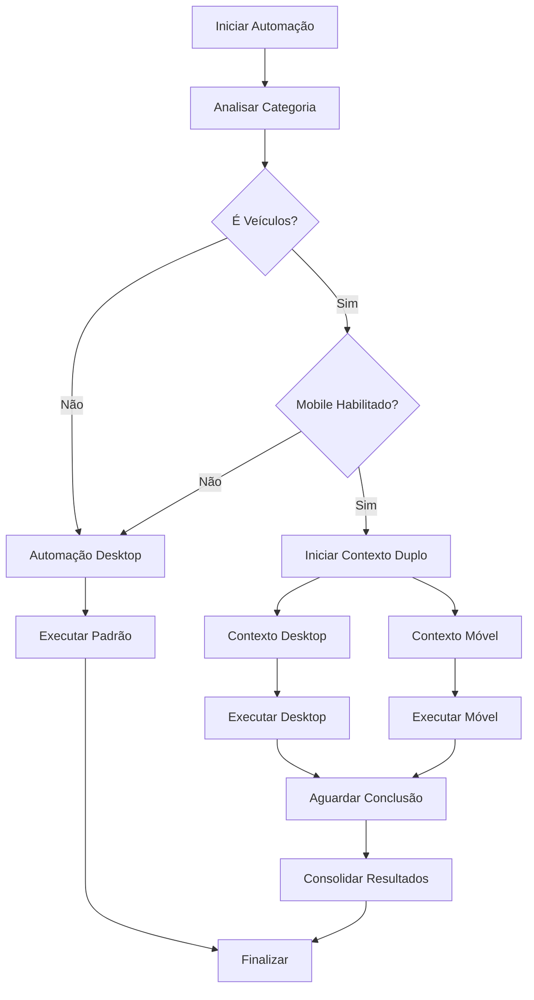

# Arquitetura de Automação Móvel para Veículos

## 1. Visão Geral do Projeto

Implementação de automação diferenciada para a categoria "Veículos" no Facebook Marketplace, utilizando User-Agent Android para acessar funcionalidades específicas disponíveis apenas em dispositivos móveis, mantendo compatibilidade com o sistema desktop existente.

## 2. Funcionalidades Principais

### 2.1 Detecção Automática de Categoria
- Sistema de detecção da categoria "Veículos" no painel de automação
- Ativação automática do contexto móvel quando necessário
- Fallback para automação desktop padrão

### 2.2 Contextos Paralelos
- Execução simultânea de automação desktop (Chromium) e móvel (User-Agent Android)
- Coordenação entre contextos para funcionalidades complementares
- Gerenciamento independente de sessões e estados

### 2.3 Automação Móvel Específica
- Configuração de User-Agent Android otimizado
- Viewport e configurações móveis
- Acesso a funcionalidades exclusivas de veículos

## 3. Arquitetura Técnica

### 3.1 Diagrama de Arquitetura



### 3.2 Componentes Principais

| Componente | Responsabilidade | Arquivo |
|------------|------------------|----------|
| CategoryDetector | Detectar categoria "Veículos" | `src/automation/categoryDetector.ts` |
| DualContextController | Gerenciar contextos paralelos | `src/automation/dualContextController.ts` |
| MobileBrowserSession | Sessão móvel Android | `src/session/mobileBrowser.ts` |
| VehicleMarketplace | Automação específica veículos | `src/facebook/vehicleMarketplace.ts` |
| AutomationCoordinator | Coordenar execuções | `src/automation/coordinator.ts` |

## 4. Estrutura de Código

### 4.1 Tipos e Interfaces

```typescript
// src/types/automation.ts
export interface AutomationType {
  desktop: 'desktop';
  mobile: 'mobile';
  dual: 'dual';
}

export interface MobileConfig {
  userAgent: string;
  viewport: { width: number; height: number };
  deviceScaleFactor: number;
  isMobile: boolean;
  hasTouch: boolean;
}

export interface VehicleAutomationConfig {
  category: 'vehicles';
  enableMobile: boolean;
  mobileConfig: MobileConfig;
  desktopConfig: BrowserConfig;
}

export interface DualContextResult {
  desktop: AutomationResult;
  mobile: AutomationResult;
  combined: boolean;
}
```

### 4.2 Configuração Móvel

```typescript
// src/config/mobileConfig.ts
export const ANDROID_USER_AGENTS = {
  CHROME_ANDROID: 'Mozilla/5.0 (Linux; Android 12; SM-G998B) AppleWebKit/537.36 (KHTML, like Gecko) Chrome/120.0.0.0 Mobile Safari/537.36',
  FACEBOOK_ANDROID: 'Mozilla/5.0 (Linux; Android 12; SM-G998B) AppleWebKit/537.36 (KHTML, like Gecko) Version/4.0 Chrome/120.0.0.0 Mobile Safari/537.36 [FB_IAB/FB4A;FBAV/442.0.0.0.0;]'
};

export const MOBILE_VIEWPORT = {
  width: 375,
  height: 812,
  deviceScaleFactor: 3,
  isMobile: true,
  hasTouch: true
};
```

### 4.3 Detector de Categoria

```typescript
// src/automation/categoryDetector.ts
export class CategoryDetector {
  static isVehicleCategory(flowData: FlowData): boolean {
    return flowData.category?.toLowerCase().includes('veículo') || 
           flowData.category?.toLowerCase().includes('vehicle') ||
           flowData.category?.toLowerCase().includes('carro') ||
           flowData.category?.toLowerCase().includes('moto');
  }

  static shouldUseMobileAutomation(flowData: FlowData): boolean {
    return this.isVehicleCategory(flowData) && 
           process.env.ENABLE_MOBILE_VEHICLES === 'true';
  }
}
```

## 5. Fluxo de Execução

### 5.1 Processo Principal

1. **Detecção de Categoria**
   - Análise dos dados do fluxo no painel
   - Verificação se categoria é "Veículos"
   - Decisão sobre tipo de automação

2. **Inicialização de Contextos**
   - Contexto desktop (padrão)
   - Contexto móvel (se categoria = veículos)
   - Configuração de sessões paralelas

3. **Execução Coordenada**
   - Automação desktop para funcionalidades gerais
   - Automação móvel para funcionalidades específicas
   - Sincronização de resultados

4. **Consolidação**
   - Merge de resultados
   - Relatório unificado
   - Cleanup de recursos

### 5.2 Fluxograma de Decisão



## 6. Modificações Necessárias

### 6.1 Arquivos a Modificar

| Arquivo | Modificação | Prioridade |
|---------|-------------|------------|
| `src/automation/controller.ts` | Adicionar suporte a contexto duplo | Alta |
| `src/session/browser.ts` | Estender para configuração móvel | Alta |
| `src/config.ts` | Adicionar configurações móveis | Alta |
| `src/facebook/marketplace.ts` | Separar lógica desktop/móvel | Média |
| `src/cli.ts` | Adicionar opções móveis | Média |
| `src/types/session.ts` | Novos tipos para móvel | Baixa |

### 6.2 Novos Arquivos

| Arquivo | Descrição | Prioridade |
|---------|-----------|------------|
| `src/automation/categoryDetector.ts` | Detector de categoria | Alta |
| `src/automation/dualContextController.ts` | Controlador duplo | Alta |
| `src/session/mobileBrowser.ts` | Sessão móvel | Alta |
| `src/facebook/vehicleMarketplace.ts` | Automação veículos | Média |
| `src/config/mobileConfig.ts` | Configurações móveis | Média |
| `src/automation/coordinator.ts` | Coordenador | Baixa |

## 7. Implementação Detalhada

### 7.1 Extensão do AutomationController

```typescript
// Modificações em src/automation/controller.ts
export class AutomationController {
  async startAutomation(config: AutomationConfig): Promise<AutomationResult> {
    const flowData = await this.loadFlowData(config.flowPath);
    
    if (CategoryDetector.shouldUseMobileAutomation(flowData)) {
      return this.startDualContextAutomation(config, flowData);
    }
    
    return this.startStandardAutomation(config, flowData);
  }

  private async startDualContextAutomation(
    config: AutomationConfig, 
    flowData: FlowData
  ): Promise<DualContextResult> {
    const dualController = new DualContextController(config);
    return dualController.execute(flowData);
  }
}
```

### 7.2 Sessão Móvel

```typescript
// src/session/mobileBrowser.ts
export class MobileBrowserSession extends BrowserSession {
  protected async createContext(): Promise<BrowserContext> {
    const context = await this.browser.newContext({
      ...this.baseConfig,
      userAgent: ANDROID_USER_AGENTS.FACEBOOK_ANDROID,
      viewport: MOBILE_VIEWPORT,
      deviceScaleFactor: MOBILE_VIEWPORT.deviceScaleFactor,
      isMobile: true,
      hasTouch: true,
      locale: 'pt-BR',
      timezoneId: 'America/Sao_Paulo'
    });

    await this.setupMobileInterceptors(context);
    return context;
  }

  private async setupMobileInterceptors(context: BrowserContext): Promise<void> {
    await context.route('**/*', (route) => {
      const headers = {
        ...route.request().headers(),
        'sec-ch-ua-mobile': '?1',
        'sec-ch-ua-platform': '"Android"'
      };
      route.continue({ headers });
    });
  }
}
```

## 8. Tarefas de Implementação

### 8.1 Fase 1: Estrutura Base (1-2 dias)
- [ ] Criar tipos e interfaces para automação móvel
- [ ] Implementar CategoryDetector
- [ ] Criar configurações móveis básicas
- [ ] Estender AutomationController para detecção

### 8.2 Fase 2: Contexto Móvel (2-3 dias)
- [ ] Implementar MobileBrowserSession
- [ ] Criar DualContextController
- [ ] Configurar User-Agent e viewport móvel
- [ ] Implementar interceptadores móveis

### 8.3 Fase 3: Automação Específica (3-4 dias)
- [ ] Criar VehicleMarketplace
- [ ] Implementar lógica específica para veículos
- [ ] Coordenação entre contextos
- [ ] Sistema de fallback

### 8.4 Fase 4: Integração e Testes (2-3 dias)
- [ ] Integrar com painel existente
- [ ] Testes de contextos paralelos
- [ ] Validação de performance
- [ ] Documentação de uso

### 8.5 Fase 5: Otimização (1-2 dias)
- [ ] Monitoramento e logs
- [ ] Tratamento de erros
- [ ] Configurações avançadas
- [ ] Deploy e validação

## 9. Considerações Técnicas

### 9.1 Performance
- **Recursos**: Contextos paralelos aumentam uso de CPU/RAM em ~80%
- **Otimização**: Lazy loading de contexto móvel apenas quando necessário
- **Monitoramento**: Métricas específicas para automação dupla

### 9.2 Compatibilidade
- **Sistema Existente**: 100% compatível, sem breaking changes
- **Sessões**: Reutilização de sistema de sessões atual
- **API**: Extensão da API multi-tenant existente

### 9.3 Segurança
- **User-Agent**: Rotação de User-Agents Android válidos
- **Fingerprinting**: Configurações móveis realistas
- **Rate Limiting**: Coordenação para evitar sobrecarga

### 9.4 Monitoramento
- **Logs Específicos**: Contexto móvel identificado nos logs
- **Métricas**: Tempo de execução, taxa de sucesso por contexto
- **Alertas**: Falhas específicas de automação móvel

## 10. Configuração de Ambiente

### 10.1 Variáveis de Ambiente
```bash
# Habilitar automação móvel para veículos
ENABLE_MOBILE_VEHICLES=true

# Configurações móveis
MOBILE_USER_AGENT=custom_android_ua
MOBILE_VIEWPORT_WIDTH=375
MOBILE_VIEWPORT_HEIGHT=812

# Debug móvel
DEBUG_MOBILE_AUTOMATION=false
```

### 10.2 Configuração CLI
```bash
# Forçar automação móvel
npm start -- --mobile-vehicles

# Debug contexto duplo
npm start -- --debug-dual-context

# Apenas contexto móvel (teste)
npm start -- --mobile-only
```

Esta arquitetura permite implementar automação móvel específica para veículos de forma incremental, mantendo total compatibilidade com o sistema existente e aproveitando a infraestrutura multi-tenant já estabelecida.