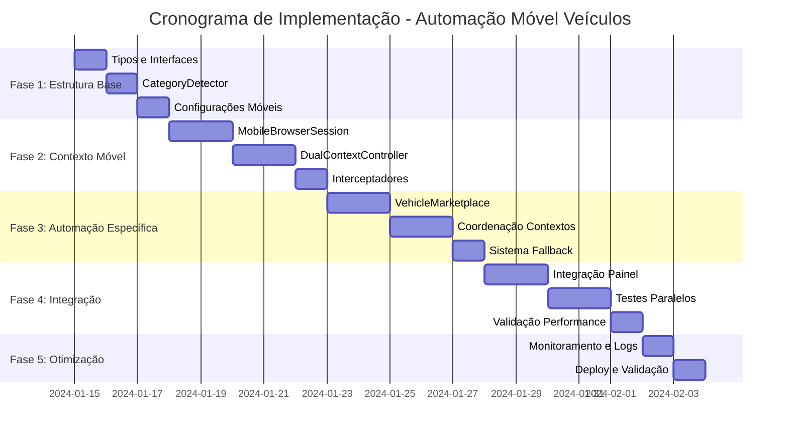

# Plano de Implementação - Automação Móvel para Veículos

## 1. Visão Geral do Projeto

**Objetivo**: Implementar automação móvel específica para categoria "Veículos" no Facebook Marketplace, utilizando User-Agent Android para acessar funcionalidades exclusivas móveis.

**Duração Estimada**: 11-14 dias úteis
**Complexidade**: Média-Alta
**Impacto no Sistema**: Baixo (extensão sem breaking changes)

## 2. Cronograma de Implementação

### 2.1 Visão Geral das Fases

| Fase | Duração | Dependências | Entregáveis |
|------|---------|--------------|-------------|
| Fase 1: Estrutura Base | 2 dias | - | Tipos, detector, configurações |
| Fase 2: Contexto Móvel | 3 dias | Fase 1 | Sessão móvel, controlador duplo |
| Fase 3: Automação Específica | 4 dias | Fase 2 | Lógica veículos, coordenação |
| Fase 4: Integração e Testes | 3 dias | Fase 3 | Integração painel, testes |
| Fase 5: Otimização | 2 dias | Fase 4 | Monitoramento, deploy |

### 2.2 Cronograma Detalhado

## 3. Tarefas Detalhadas por Fase

### 3.1 Fase 1: Estrutura Base (Dias 1-2)

#### Dia 1: Tipos e Interfaces

**Arquivo**: `src/types/automation.ts`
- [ ] Criar interface `AutomationType`
- [ ] Definir `MobileConfig` com configurações Android
- [ ] Implementar `VehicleAutomationConfig`
- [ ] Criar `DualContextResult` para resultados paralelos
- [ ] Adicionar tipos para User-Agent e viewport móvel

**Arquivo**: `src/types/session.ts`
- [ ] Estender `BrowserConfig` para suporte móvel
- [ ] Adicionar `MobileSessionConfig`
- [ ] Criar tipos para interceptadores móveis

**Critérios de Aceitação**:
- [ ] Todos os tipos compilam sem erros
- [ ] Interfaces são compatíveis com sistema existente
- [ ] Documentação TypeScript completa

#### Dia 2: CategoryDetector e Configurações

**Arquivo**: `src/automation/categoryDetector.ts`
- [ ] Implementar `CategoryDetector.isVehicleCategory()`
- [ ] Criar `CategoryDetector.shouldUseMobileAutomation()`
- [ ] Adicionar suporte a múltiplos idiomas (PT, EN, ES)
- [ ] Implementar cache de detecção para performance

**Arquivo**: `src/config/mobileConfig.ts`
- [ ] Definir `ANDROID_USER_AGENTS` com lista válida
- [ ] Configurar `MOBILE_VIEWPORT` otimizado
- [ ] Criar presets para diferentes dispositivos Android
- [ ] Implementar validação de configurações móveis

**Critérios de Aceitação**:
- [ ] Detecção funciona para todas as variações de "veículos"
- [ ] Configurações móveis são válidas e testadas
- [ ] Performance de detecção <1ms

### 3.2 Fase 2: Contexto Móvel (Dias 3-5)

#### Dias 3-4: MobileBrowserSession

**Arquivo**: `src/session/mobileBrowser.ts`
- [ ] Estender `BrowserSession` para contexto móvel
- [ ] Implementar `createContext()` com configurações Android
- [ ] Configurar User-Agent e viewport móvel
- [ ] Adicionar headers específicos Android
- [ ] Implementar `setupMobileInterceptors()`
- [ ] Criar sistema de rotação de User-Agent
- [ ] Adicionar validação de compatibilidade móvel

**Testes**:
- [ ] Teste de inicialização de contexto móvel
- [ ] Validação de User-Agent aplicado
- [ ] Teste de interceptadores móveis
- [ ] Verificação de headers Android

#### Dia 5: DualContextController

**Arquivo**: `src/automation/dualContextController.ts`
- [ ] Implementar inicialização de contextos paralelos
- [ ] Criar sistema de coordenação entre contextos
- [ ] Implementar `execute()` para automação dupla
- [ ] Adicionar gerenciamento de recursos
- [ ] Criar sistema de sincronização
- [ ] Implementar cleanup automático

**Critérios de Aceitação**:
- [ ] Contextos inicializam em paralelo sem conflitos
- [ ] Recursos são gerenciados adequadamente
- [ ] Cleanup automático funciona corretamente

### 3.3 Fase 3: Automação Específica (Dias 6-9)

#### Dias 6-7: VehicleMarketplace

**Arquivo**: `src/facebook/vehicleMarketplace.ts`
- [ ] Criar classe `VehicleMarketplace` específica
- [ ] Implementar navegação móvel otimizada
- [ ] Adicionar seletores específicos para versão móvel
- [ ] Criar lógica para funcionalidades exclusivas móveis
- [ ] Implementar preenchimento de formulários móveis
- [ ] Adicionar validação específica para veículos
- [ ] Criar sistema de screenshots móveis

**Funcionalidades Específicas**:
- [ ] Acesso a campos exclusivos móveis
- [ ] Upload de imagens otimizado para móvel
- [ ] Navegação por categorias específicas
- [ ] Preenchimento de dados técnicos do veículo

#### Dias 8-9: Coordenação e Fallback

**Arquivo**: `src/automation/coordinator.ts`
- [ ] Implementar `AutomationCoordinator`
- [ ] Criar lógica de coordenação entre contextos
- [ ] Implementar sistema de fallback automático
- [ ] Adicionar consolidação de resultados
- [ ] Criar sistema de retry inteligente
- [ ] Implementar monitoramento de saúde dos contextos

**Sistema de Fallback**:
- [ ] Detecção automática de falhas móveis
- [ ] Fallback para contexto desktop
- [ ] Preservação de dados já processados
- [ ] Notificação de mudança de contexto

### 3.4 Fase 4: Integração e Testes (Dias 10-12)

#### Dias 10-11: Integração com Sistema Existente

**Arquivo**: `src/automation/controller.ts`
- [ ] Modificar `AutomationController.startAutomation()`
- [ ] Integrar `CategoryDetector` no fluxo principal
- [ ] Adicionar suporte a `DualContextController`
- [ ] Manter compatibilidade com automação padrão
- [ ] Implementar logs específicos para contexto duplo

**Arquivo**: `src/cli.ts`
- [ ] Adicionar opções CLI para automação móvel
- [ ] Implementar `--mobile-vehicles` flag
- [ ] Adicionar `--debug-dual-context` para debug
- [ ] Criar `--mobile-only` para testes

**Arquivo**: `src/config.ts`
- [ ] Integrar configurações móveis no sistema
- [ ] Adicionar validação de configurações duplas
- [ ] Implementar carregamento de presets móveis

#### Dia 12: Testes Integrados

**Testes de Integração**:
- [ ] Teste completo de fluxo com categoria veículos
- [ ] Validação de contextos paralelos
- [ ] Teste de fallback automático
- [ ] Verificação de performance com contexto duplo
- [ ] Teste de compatibilidade com sistema existente

**Testes de Performance**:
- [ ] Medição de uso de recursos (CPU/RAM)
- [ ] Tempo de inicialização de contextos
- [ ] Throughput de automação dupla
- [ ] Latência de coordenação entre contextos

### 3.5 Fase 5: Otimização e Deploy (Dias 13-14)

#### Dia 13: Monitoramento e Logs

**Sistema de Logs**:
- [ ] Implementar logs específicos para contexto móvel
- [ ] Adicionar métricas de performance
- [ ] Criar alertas para falhas móveis
- [ ] Implementar dashboard de monitoramento

**Arquivo**: `src/logger.ts`
- [ ] Estender logger para contextos paralelos
- [ ] Adicionar tags específicas para móvel
- [ ] Implementar rotação de logs por contexto

#### Dia 14: Deploy e Validação Final

**Deploy**:
- [ ] Configurar variáveis de ambiente
- [ ] Atualizar documentação de uso
- [ ] Criar guia de troubleshooting
- [ ] Implementar feature flags para rollout gradual

**Validação Final**:
- [ ] Teste em ambiente de produção
- [ ] Validação com dados reais de veículos
- [ ] Verificação de estabilidade do sistema
- [ ] Confirmação de métricas de sucesso

## 4. Checklist de Qualidade

### 4.1 Checklist de Código

**Estrutura e Organização**:
- [ ] Código segue padrões existentes do projeto
- [ ] Arquivos organizados na estrutura correta
- [ ] Imports e exports consistentes
- [ ] Nomenclatura clara e descritiva

**Funcionalidade**:
- [ ] Todas as funcionalidades implementadas conforme especificação
- [ ] Tratamento de erros adequado
- [ ] Validação de entrada de dados
- [ ] Logs informativos em pontos críticos

**Performance**:
- [ ] Uso eficiente de recursos
- [ ] Otimização de consultas e operações
- [ ] Cleanup adequado de recursos
- [ ] Monitoramento de performance implementado

### 4.2 Checklist de Testes

**Testes Unitários**:
- [ ] CategoryDetector - detecção de categoria
- [ ] MobileBrowserSession - inicialização e configuração
- [ ] DualContextController - coordenação de contextos
- [ ] VehicleMarketplace - automação específica
- [ ] AutomationCoordinator - consolidação de resultados

**Testes de Integração**:
- [ ] Fluxo completo com categoria veículos
- [ ] Integração com sistema existente
- [ ] Compatibilidade com API multi-tenant
- [ ] Funcionamento com diferentes configurações

**Testes de Performance**:
- [ ] Uso de recursos dentro dos limites
- [ ] Tempo de resposta aceitável
- [ ] Estabilidade com carga
- [ ] Eficiência de contextos paralelos

### 4.3 Checklist de Documentação

**Documentação Técnica**:
- [ ] Comentários no código para lógica complexa
- [ ] README atualizado com novas funcionalidades
- [ ] Documentação de API para novas interfaces
- [ ] Guia de configuração móvel

**Documentação de Usuário**:
- [ ] Guia de uso da automação móvel
- [ ] Troubleshooting para problemas comuns
- [ ] Exemplos de configuração
- [ ] FAQ sobre funcionalidades móveis

## 5. Riscos e Mitigações

### 5.1 Riscos Técnicos

| Risco | Probabilidade | Impacto | Mitigação |
|-------|---------------|---------|----------|
| Detecção de bot pelo Facebook | Média | Alto | User-Agents válidos, rotação, headers realistas |
| Performance degradada | Baixa | Médio | Monitoramento, otimização, feature flags |
| Conflitos entre contextos | Baixa | Alto | Coordenação adequada, testes extensivos |
| Incompatibilidade móvel | Média | Médio | Fallback automático, validação prévia |

### 5.2 Riscos de Projeto

| Risco | Probabilidade | Impacto | Mitigação |
|-------|---------------|---------|----------|
| Atraso na implementação | Média | Médio | Buffer de tempo, priorização de features |
| Complexidade subestimada | Baixa | Alto | Revisão técnica, prototipagem |
| Mudanças no Facebook | Baixa | Alto | Monitoramento, adaptação rápida |

## 6. Critérios de Sucesso

### 6.1 Métricas Técnicas
- **Detecção de Categoria**: 100% precisão para palavras-chave definidas
- **Inicialização**: Contexto móvel em <5 segundos
- **Taxa de Sucesso**: >95% para automações móveis
- **Recursos**: Aumento <100% CPU/RAM
- **Disponibilidade**: >99% uptime do sistema

### 6.2 Métricas de Qualidade
- **Cobertura de Testes**: >90% para código novo
- **Bugs Críticos**: 0 em produção
- **Performance**: Sem degradação do sistema existente
- **Compatibilidade**: 100% backward compatibility

### 6.3 Métricas de Usuário
- **Facilidade de Uso**: Ativação automática transparente
- **Controle**: Possibilidade de desativação manual
- **Feedback**: Status visual claro em tempo real
- **Confiabilidade**: Fallback automático funcional

## 7. Pós-Implementação

### 7.1 Monitoramento Contínuo
- [ ] Configurar alertas para falhas móveis
- [ ] Implementar dashboard de métricas
- [ ] Monitorar performance de contextos paralelos
- [ ] Acompanhar taxa de uso da funcionalidade

### 7.2 Manutenção
- [ ] Atualização regular de User-Agents Android
- [ ] Monitoramento de mudanças no Facebook
- [ ] Otimização baseada em métricas de uso
- [ ] Expansão para outras categorias se necessário

### 7.3 Evolução Futura
- [ ] Suporte a outras categorias específicas
- [ ] Automação móvel para Instagram
- [ ] IA para otimização de User-Agent
- [ ] Interface gráfica para configuração móvel

Este plano de implementação garante uma abordagem estruturada e incremental, minimizando riscos e maximizando a qualidade da entrega final.