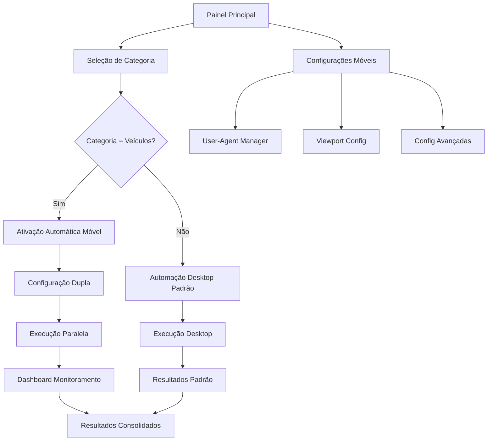

# PRD - Automação Móvel para Veículos no Facebook Marketplace

## 1. Visão Geral do Produto

Extensão do sistema de automação existente para suportar funcionalidades específicas de veículos no Facebook Marketplace através de automação móvel (User-Agent Android), ativada automaticamente quando o usuário seleciona a categoria "Veículos" no painel de automação.

O produto resolve a limitação de acesso a funcionalidades exclusivas para dispositivos móveis no Marketplace de veículos, mantendo total compatibilidade com o sistema desktop existente.

## 2. Funcionalidades Principais

### 2.1 Papéis de Usuário

| Papel | Método de Acesso | Permissões Principais |
|-------|------------------|----------------------|
| Usuário Padrão | Login existente no painel | Pode usar automação desktop e móvel para veículos |
| Administrador | Acesso completo ao sistema | Pode configurar e monitorar automações móveis |

### 2.2 Módulos de Funcionalidade

Nosso sistema de automação móvel para veículos consiste nas seguintes páginas principais:

1. **Painel de Automação**: seleção de categoria, configuração móvel, status de execução dupla.
2. **Dashboard de Monitoramento**: métricas de contextos paralelos, logs específicos móveis, performance comparativa.
3. **Configurações Móveis**: User-Agent Android, viewport móvel, configurações avançadas.

### 2.3 Detalhes das Páginas

| Nome da Página | Nome do Módulo | Descrição da Funcionalidade |
|----------------|----------------|-----------------------------|
| Painel de Automação | Seletor de Categoria | Detectar automaticamente categoria "Veículos" e ativar modo móvel. Exibir indicador visual de automação dupla ativa. |
| Painel de Automação | Configuração Móvel | Permitir ativação/desativação manual da automação móvel. Configurar User-Agent Android personalizado. |
| Painel de Automação | Status de Execução | Mostrar progresso paralelo de contextos desktop e móvel. Exibir logs em tempo real de ambos os contextos. |
| Dashboard de Monitoramento | Métricas de Performance | Comparar tempo de execução, taxa de sucesso e recursos utilizados entre contextos. Gráficos de performance histórica. |
| Dashboard de Monitoramento | Logs Específicos | Filtrar logs por contexto (desktop/móvel). Exportar logs de automação móvel. Alertas de falhas específicas. |
| Configurações Móveis | User-Agent Manager | Gerenciar lista de User-Agents Android válidos. Rotação automática de User-Agents. Teste de compatibilidade. |
| Configurações Móveis | Viewport Móvel | Configurar dimensões de tela móvel. Ajustar device scale factor. Simular diferentes dispositivos Android. |
| Configurações Móveis | Configurações Avançadas | Habilitar/desabilitar interceptadores móveis. Configurar headers específicos Android. Ajustar timeouts móveis. |

## 3. Processo Principal

### 3.1 Fluxo do Usuário

**Fluxo de Automação com Detecção Automática:**
1. Usuário acessa o painel de automação
2. Seleciona ou carrega dados com categoria "Veículos"
3. Sistema detecta automaticamente a categoria
4. Interface exibe indicador de "Automação Móvel Ativada"
5. Usuário inicia a automação normalmente
6. Sistema executa contextos desktop e móvel em paralelo
7. Dashboard mostra progresso de ambos os contextos
8. Resultados são consolidados automaticamente

**Fluxo de Configuração Manual:**
1. Usuário acessa configurações móveis
2. Ativa/desativa automação móvel para veículos
3. Configura User-Agent Android personalizado
4. Ajusta viewport e configurações avançadas
5. Testa configurações com preview
6. Salva configurações para uso futuro

### 3.2 Fluxograma de Navegação

## 4. Design da Interface do Usuário

### 4.1 Estilo de Design

- **Cores Primárias**: #1877F2 (azul Facebook), #42B883 (verde sucesso)
- **Cores Secundárias**: #FF6B6B (vermelho erro), #FFA726 (laranja aviso)
- **Estilo de Botões**: Rounded corners (8px), elevation shadow, hover effects
- **Fonte**: Inter, 14px base, 16px títulos, 12px labels
- **Layout**: Card-based design, sidebar navigation, responsive grid
- **Ícones**: Material Design icons, 24px padrão, outline style

### 4.2 Visão Geral do Design das Páginas

| Nome da Página | Nome do Módulo | Elementos da UI |
|----------------|----------------|----------------|
| Painel de Automação | Seletor de Categoria | Dropdown com categorias, badge "Móvel Ativo" em verde, tooltip explicativo, ícone de smartphone |
| Painel de Automação | Status de Execução | Progress bars paralelas (desktop/móvel), indicadores de status coloridos, logs em tempo real com scroll, botão de pausa/retomar |
| Dashboard de Monitoramento | Métricas de Performance | Gráficos de linha para performance, cards com métricas principais, tabela comparativa, filtros de data |
| Configurações Móveis | User-Agent Manager | Lista de User-Agents com status, botão "Adicionar Novo", toggle de rotação automática, botão de teste |
| Configurações Móveis | Viewport Móvel | Sliders para width/height, preview visual do viewport, presets de dispositivos populares, toggle de orientação |

### 4.3 Responsividade

O produto é desktop-first com adaptação móvel para o painel de administração. A automação móvel refere-se ao User-Agent utilizado na automação, não à interface do usuário, que permanece otimizada para desktop com suporte a tablets.

## 5. Funcionalidades Específicas

### 5.1 Detecção Automática de Categoria

**Comportamento:**
- Sistema analisa dados do fluxo em tempo real
- Detecta palavras-chave: "veículo", "carro", "moto", "vehicle", "car", "motorcycle"
- Ativa automaticamente modo móvel quando detectado
- Exibe notificação visual no painel
- Permite desativação manual se necessário

**Interface:**
- Badge verde "Automação Móvel Ativa" no topo do painel
- Ícone de smartphone ao lado da categoria selecionada
- Tooltip explicativo sobre funcionalidades móveis
- Toggle para desativar automação móvel temporariamente

### 5.2 Execução de Contextos Paralelos

**Comportamento:**
- Inicia contexto desktop (Chromium padrão)
- Inicia contexto móvel (User-Agent Android) simultaneamente
- Coordena execução para evitar conflitos
- Consolida resultados automaticamente
- Fornece fallback para desktop em caso de falha móvel

**Interface:**
- Duas progress bars lado a lado (Desktop | Móvel)
- Indicadores de status coloridos (verde=ativo, azul=aguardando, vermelho=erro)
- Logs separados por contexto com abas
- Métricas de tempo e recursos em tempo real
- Botões individuais de pausa/retomar para cada contexto

### 5.3 Configuração de User-Agent Móvel

**Comportamento:**
- Lista pré-configurada de User-Agents Android válidos
- Rotação automática para evitar detecção
- Validação de compatibilidade com Facebook
- Teste de funcionalidade antes da aplicação
- Backup automático de configurações

**Interface:**
- Tabela com User-Agents disponíveis e status
- Campo para adicionar User-Agent customizado
- Botão "Testar Compatibilidade" com feedback visual
- Toggle "Rotação Automática" com intervalo configurável
- Preview do User-Agent ativo no momento

### 5.4 Monitoramento e Logs

**Comportamento:**
- Logs específicos para contexto móvel
- Métricas de performance comparativas
- Alertas automáticos para falhas móveis
- Exportação de relatórios detalhados
- Histórico de execuções com filtros

**Interface:**
- Dashboard com gráficos de performance
- Filtros por contexto, data e status
- Tabela de logs com busca e ordenação
- Cards com métricas principais (tempo, sucesso, recursos)
- Botão de exportação com opções de formato

## 6. Critérios de Sucesso

### 6.1 Métricas de Performance
- **Detecção de Categoria**: 100% de precisão para palavras-chave definidas
- **Tempo de Inicialização**: Contexto móvel deve iniciar em <5 segundos
- **Taxa de Sucesso**: >95% para automações móveis de veículos
- **Uso de Recursos**: Aumento <100% no uso de CPU/RAM

### 6.2 Experiência do Usuário
- **Transparência**: Usuário deve entender claramente quando automação móvel está ativa
- **Controle**: Possibilidade de desativar automação móvel a qualquer momento
- **Feedback**: Status visual claro do progresso de ambos os contextos
- **Confiabilidade**: Fallback automático para desktop em caso de falha móvel

### 6.3 Compatibilidade
- **Sistema Existente**: Zero breaking changes no sistema atual
- **Sessões**: Reutilização completa do sistema de sessões existente
- **API**: Extensão da API multi-tenant sem modificações disruptivas
- **Configurações**: Todas as configurações existentes permanecem funcionais

Esta funcionalidade representa uma evolução natural do sistema existente, aproveitando a arquitetura robusta já estabelecida para oferecer capacidades avançadas específicas para o mercado de veículos no Facebook Marketplace.