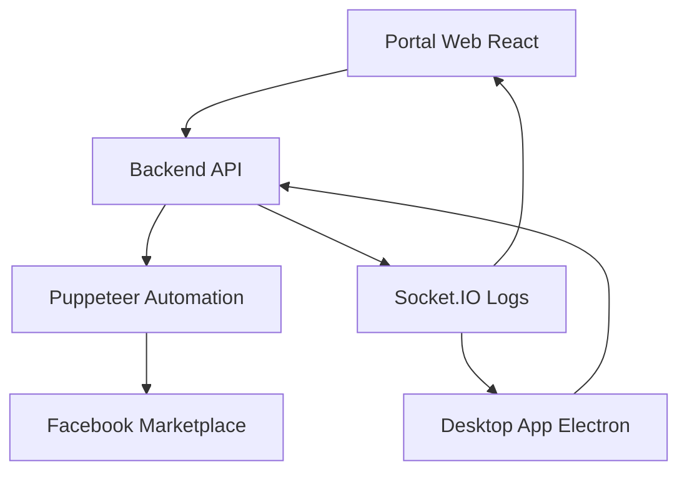

## 1. Product Overview

Vendaboost Puppeteer é uma plataforma de automação segura para Facebook Marketplace que será reestruturada em uma arquitetura modular multi-serviços. O sistema permite publicação automatizada de produtos com logs em tempo real e interface web/desktop.

O projeto resolve a necessidade de automação eficiente do Facebook Marketplace, oferecendo interfaces web e desktop para diferentes tipos de usuários, com backend robusto para processamento de automação.

## 2. Core Features

### 2.1 User Roles

| Role            | Registration Method      | Core Permissions                                  |
| --------------- | ------------------------ | ------------------------------------------------- |
| Usuário Web     | Acesso via portal web    | Pode agendar publicações, visualizar logs básicos |
| Usuário Desktop | Aplicação Electron local | Acesso completo, automação local, logs detalhados |
| Administrador   | Configuração do sistema  | Gerenciamento completo, configurações avançadas   |

### 2.2 Feature Module

Nossa plataforma de automação consiste nas seguintes aplicações principais:

1. **Backend API**: gerenciamento de dados, processamento de automação, logs centralizados
2. **Portal Web**: interface React para agendamento e monitoramento
3. **Aplicação Desktop**: Electron com Puppeteer integrado para automação local
4. **Painel de Logs**: visualização em tempo real via Socket.IO

### 2.3 Page Details

| Page Name   | Module Name      | Feature description                                                             |
| ----------- | ---------------- | ------------------------------------------------------------------------------- |
| Portal Web  | Dashboard        | Visualizar estatísticas, agendar publicações, monitorar status                  |
| Portal Web  | Agendamento      | Formulário para criar publicações (título, preço, descrição, foto, localização) |
| Portal Web  | Logs             | Visualização de logs em tempo real com filtros e histórico                      |
| Desktop App | Main Window      | Interface principal com controles de automação e configurações                  |
| Desktop App | Automation Panel | Controle direto do Puppeteer, sessão do navegador, login manual                 |
| Desktop App | Settings         | Configurações locais, diretório de dados, flags do navegador                    |
| Backend API | Health Check     | Endpoint de status do servidor e conectividade                                  |
| Backend API | Item Management  | CRUD de itens para publicação no marketplace                                    |
| Backend API | Log Management   | Sistema centralizado de logs com WebSocket                                      |

## 3. Core Process

**Fluxo do Portal Web:**

1. Usuário acessa portal web React
2. Faz login/autenticação
3. Acessa dashboard com estatísticas
4. Agenda nova publicação via formulário
5. Monitora logs em tempo real
6. Visualiza histórico de publicações

**Fluxo da Aplicação Desktop:**

1. Usuário abre aplicação Electron
2. Configura sessão do navegador (login manual Facebook)
3. Inicia automação local com Puppeteer
4. Monitora processo em tempo real
5. Visualiza logs detalhados
6. Gerencia configurações avançadas

**Fluxo do Backend:**

1. Recebe requisições dos clientes (web/desktop)
2. Processa dados de publicação
3. Executa automação via Puppeteer
4. Emite logs via Socket.IO
5. Persiste dados e histórico

## 4. User Interface Design

### 4.1 Design Style

* **Cores primárias**: #1877F2 (Facebook Blue), #42B883 (Success Green)

* **Cores secundárias**: #6C757D (Gray), #DC3545 (Error Red), #FFC107 (Warning Yellow)

* **Estilo de botões**: Rounded corners (8px), subtle shadows, hover effects

* **Fontes**: Inter (primary), Roboto Mono (logs/code)

* **Tamanhos**: 14px (body), 16px (buttons), 18px (headings), 12px (captions)

* **Layout**: Card-based design, sidebar navigation, responsive grid

* **Ícones**: Feather icons, Material Design icons para ações

### 4.2 Page Design Overview

| Page Name   | Module Name      | UI Elements                                                                            |
| ----------- | ---------------- | -------------------------------------------------------------------------------------- |
| Portal Web  | Dashboard        | Cards com métricas, gráficos de linha para estatísticas, lista de publicações recentes |
| Portal Web  | Agendamento      | Formulário em steps, upload de imagem com preview, validação em tempo real             |
| Portal Web  | Logs             | Terminal-style com syntax highlighting, filtros por nível, auto-scroll                 |
| Desktop App | Main Window      | Native window controls, system tray integration, dark/light theme                      |
| Desktop App | Automation Panel | Browser preview iframe, control buttons, progress indicators                           |
| Desktop App | Settings         | Tabbed interface, file/folder pickers, toggle switches                                 |

### 4.3 Responsiveness

* **Portal Web**: Mobile-first responsive design com breakpoints em 768px, 1024px, 1440px

* **Desktop App**: Fixed window size com minimum 1024x768, resizable panels

* **Touch optimization**: Botões com 44px mínimo, gestos de swipe para navegação mobile

