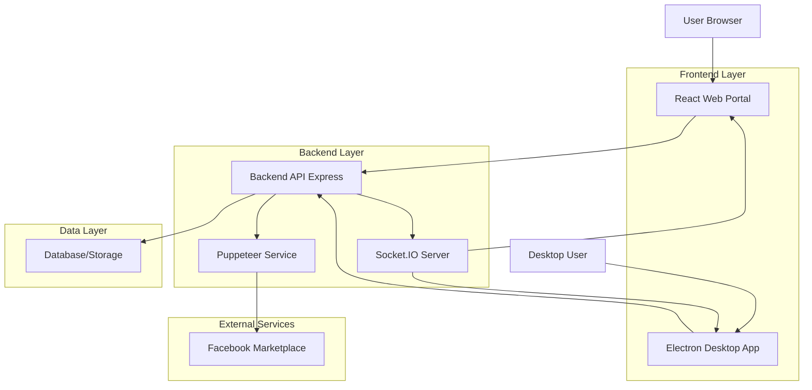
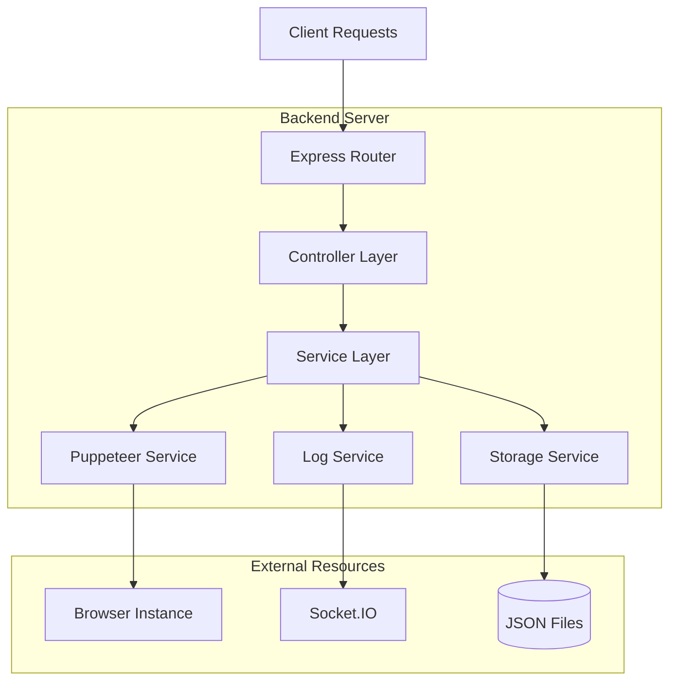
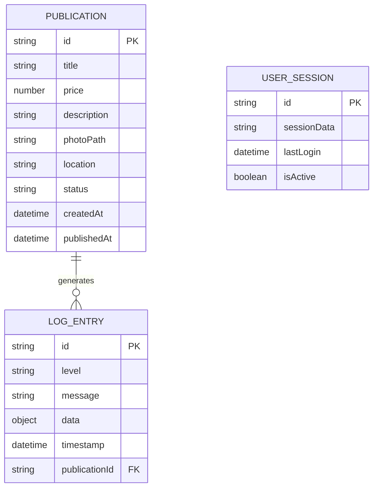

## 1. Architecture Design



## 2. Technology Description

* **Backend**: Node.js\@22 + Express\@5 + Socket.IO\@4 + Puppeteer\@24

* **Web Portal**: React\@18 + Vite + TailwindCSS\@3 + Axios

* **Desktop App**: Electron\@latest + React\@18 + Puppeteer\@24

* **Database**: JSON files + Local Storage (simple deployment)

* **Containerization**: Docker + Docker Compose

## 3. Route Definitions

### Web Portal Routes

| Route     | Purpose                                            |
| --------- | -------------------------------------------------- |
| /         | Dashboard principal com estatísticas e visão geral |
| /schedule | Página de agendamento de publicações               |
| /logs     | Visualização de logs em tempo real                 |
| /history  | Histórico de publicações realizadas                |
| /settings | Configurações do usuário e preferências            |

### Desktop App Routes

| Route       | Purpose                                     |
| ----------- | ------------------------------------------- |
| /main       | Janela principal com controles de automação |
| /browser    | Painel do navegador para login manual       |
| /automation | Controles avançados de automação            |
| /settings   | Configurações locais e preferências         |
| /logs       | Logs detalhados da aplicação                |

## 4. API Definitions

### 4.1 Core API

**Agendamento de publicação**

```
POST /api/schedule-item
```

Request:

| Param Name  | Param Type | isRequired | Description                 |
| ----------- | ---------- | ---------- | --------------------------- |
| title       | string     | true       | Título do produto           |
| price       | number     | true       | Preço do produto            |
| description | string     | true       | Descrição detalhada         |
| photoPath   | string     | true       | Caminho para a foto         |
| location    | string     | false      | Localização (padrão: Sinop) |

Response:

| Param Name | Param Type | Description              |
| ---------- | ---------- | ------------------------ |
| success    | boolean    | Status da operação       |
| message    | string     | Mensagem de retorno      |
| itemData   | object     | Dados do item processado |

Example:

```json
{
  "title": "iPhone 13 Pro Max",
  "price": 3500.00,
  "description": "iPhone em perfeito estado",
  "photoPath": "/uploads/iphone.jpg",
  "location": "Sinop, MT"
}
```

**Sistema de logs**

```
GET /api/logs
POST /api/logs/clear
WebSocket /socket.io
```

**Health check**

```
GET /api/health
```

**Histórico de publicações**

```
GET /api/history
GET /api/history/:id
DELETE /api/history/:id
```

## 5. Server Architecture Diagram



## 6. Data Model

### 6.1 Data Model Definition



### 6.2 Data Definition Language

**Publications Storage (publications.json)**

```json
{
  "publications": [
    {
      "id": "uuid-v4",
      "title": "string",
      "price": "number",
      "description": "string",
      "photoPath": "string",
      "location": "string",
      "status": "pending|processing|completed|failed",
      "createdAt": "ISO-8601",
      "publishedAt": "ISO-8601|null",
      "error": "string|null"
    }
  ]
}
```

**Logs Storage (logs.json)**

```json
{
  "logs": [
    {
      "id": "uuid-v4",
      "level": "info|success|warning|error",
      "message": "string",
      "data": "object|null",
      "timestamp": "ISO-8601",
      "publicationId": "string|null"
    }
  ]
}
```

**User Session Storage (session.json)**

```json
{
  "session": {
    "id": "uuid-v4",
    "userDataDir": "string",
    "lastLogin": "ISO-8601",
    "isActive": "boolean",
    "browserSettings": {
      "headless": "boolean",
      "userAgent": "string",
      "viewport": {
        "width": "number",
        "height": "number"
      }
    }
  }
}
```

## 7. Project Structure Implementation

### Backend Structure

```
backend/
├── src/
│   ├── controllers/
│   │   ├── publicationController.js
│   │   ├── logController.js
│   │   └── healthController.js
│   ├── models/
│   │   ├── Publication.js
│   │   ├── LogEntry.js
│   │   └── UserSession.js
│   ├── routes/
│   │   ├── publications.js
│   │   ├── logs.js
│   │   └── health.js
│   ├── services/
│   │   ├── puppeteerService.js
│   │   ├── logService.js
│   │   ├── storageService.js
│   │   └── socketService.js
│   ├── middleware/
│   │   ├── errorHandler.js
│   │   ├── logger.js
│   │   └── cors.js
│   ├── utils/
│   │   ├── fileUtils.js
│   │   └── validators.js
│   └── app.js
├── data/
│   ├── publications.json
│   ├── logs.json
│   └── session.json
├── uploads/
├── user-data/
├── package.json
├── Dockerfile
└── .env.example
```

### Desktop App Structure

```
desktop-app/
├── src/
│   ├── main/
│   │   ├── main.js
│   │   ├── menu.js
│   │   └── windows.js
│   ├── renderer/
│   │   ├── components/
│   │   ├── pages/
│   │   ├── services/
│   │   └── index.html
│   └── automation/
│       ├── puppeteerManager.js
│       ├── browserController.js
│       └── automationService.js
├── assets/
├── package.json
└── electron-builder.json
```

### Web Portal Structure

```
web-portal/
├── src/
│   ├── components/
│   │   ├── common/
│   │   ├── forms/
│   │   └── charts/
│   ├── pages/
│   │   ├── Dashboard.jsx
│   │   ├── Schedule.jsx
│   │   ├── Logs.jsx
│   │   └── History.jsx
│   ├── services/
│   │   ├── api.js
│   │   ├── socket.js
│   │   └── storage.js
│   ├── hooks/
│   ├── utils/
│   ├── styles/
│   └── App.jsx
├── public/
├── package.json
├── vite.config.js
├── tailwind.config.js
└── Dockerfile
```

