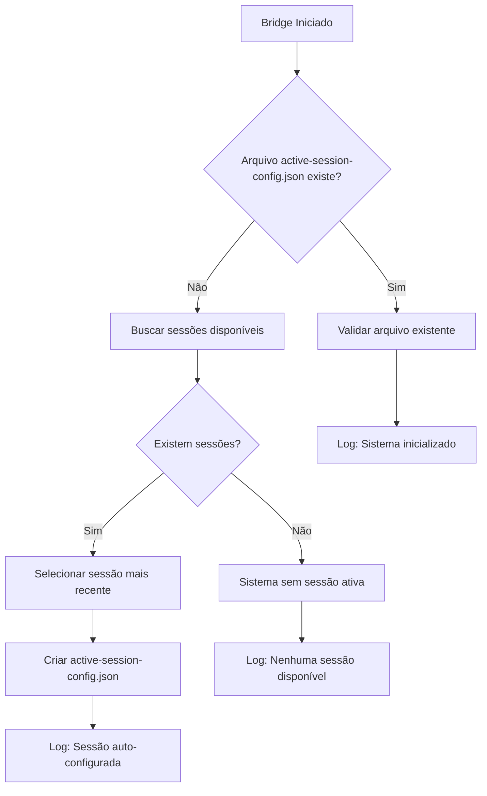

# Recriação Automática do Arquivo active-session-config.json

## 📋 Visão Geral

Este documento explica como o sistema VendaBoost Desktop gerencia automaticamente o arquivo `active-session-config.json`, incluindo sua recriação automática quando excluído acidentalmente.

## 🔄 Comportamento de Recriação Automática

### ✅ **Resposta Rápida: SIM, o arquivo se recria sozinho!**

O arquivo `active-session-config.json` é **automaticamente recriado** sempre que:
- O bridge é iniciado (`npm run bridge` ou `node dist/cli.js --start-bridge`)
- O arquivo não existe no diretório `data/sessions/`
- Existem sessões salvas disponíveis no sistema

## 🛠️ Como Funciona a Recriação

### 1. Verificação na Inicialização

Quando o sistema é iniciado, a função `initializeSessionSystem()` executa os seguintes passos:

```typescript
// Verifica se o arquivo de configuração existe
const configExists = await fs.access(ACTIVE_SESSION_CONFIG)
  .then(() => true)
  .catch(() => false);

if (!configExists) {
  // Arquivo não existe - inicia processo de recriação
  const sessions = await getAllSessions();
  if (sessions.length > 0) {
    const mostRecentSession = sessions[0]; // Sessão mais recente
    await setActiveSessionId(mostRecentSession.id);
    info(`🚀 Sistema de sessões inicializado. Sessão ativa auto-configurada: ${mostRecentSession.id}`);
  }
}
```

### 2. Seleção Automática da Sessão

O sistema automaticamente:
- **Busca todas as sessões** disponíveis no diretório `data/sessions/`
- **Ordena por timestamp** (mais recente primeiro)
- **Seleciona a sessão mais recente** como ativa
- **Cria o arquivo** `active-session-config.json` com a configuração

### 3. Estrutura do Arquivo Recriado

```json
{
  "activeSessionId": "session-2025-08-21T19-01-27-594Z",
  "updatedAt": "2025-08-21T20:15:30.123Z"
}
```

## 📍 Localização do Arquivo

**Caminho completo:**
```
C:\Users\[USUÁRIO]\Documents\AUTOMACAO\data\sessions\active-session-config.json
```

**Estrutura do diretório:**
```
data/sessions/
├── active-session-config.json          # ← Arquivo que se recria automaticamente
├── current-session.json                # Sessão atual da extensão
├── session-2025-08-21T19-01-01-366Z.json  # Sessões salvas
└── session-2025-08-21T19-01-27-594Z.json  # (ordenadas por data)
```

## 🔍 Cenários de Recriação

### Cenário 1: Exclusão Acidental
```bash
# Usuário exclui o arquivo acidentalmente
rm data/sessions/active-session-config.json

# Na próxima inicialização do bridge:
npm run bridge
# ✅ Arquivo é recriado automaticamente com a sessão mais recente
```

### Cenário 2: Primeira Inicialização
```bash
# Sistema novo, sem arquivo de configuração
# Bridge é iniciado pela primeira vez
npm run bridge
# ✅ Arquivo é criado automaticamente se existirem sessões
```

### Cenário 3: Sistema Sem Sessões
```bash
# Diretório de sessões vazio
# Bridge é iniciado
npm run bridge
# ℹ️ Sistema inicializado, mas sem sessões disponíveis
# ❌ Arquivo NÃO é criado (não há sessões para configurar)
```

## 📝 Logs do Sistema

### Recriação Bem-Sucedida
```
🚀 Sistema de sessões inicializado. Sessão ativa auto-configurada: session-2025-08-21T19-01-27-594Z
```

### Sistema Sem Sessões
```
ℹ️ Sistema de sessões inicializado. Nenhuma sessão disponível.
```

### Arquivo Já Existe
```
✅ Sistema de sessões inicializado. Sessão ativa: session-2025-08-21T19-01-27-594Z
```

## 🔧 Código Responsável

### Arquivo: `src/utils/sessionHandler.ts`

#### Função Principal: `initializeSessionSystem()`
- **Linha ~448**: Função que gerencia a inicialização
- **Responsabilidade**: Verificar e recriar o arquivo quando necessário

#### Função de Criação: `setActiveSessionId()`
- **Linha ~408**: Função que cria/atualiza o arquivo
- **Responsabilidade**: Escrever o arquivo JSON com a configuração

## ⚡ Quando a Recriação Acontece

### ✅ **Sempre que o bridge é iniciado:**
- `npm run bridge`
- `npm run bridge:dev`
- `node dist/cli.js --start-bridge`
- Qualquer inicialização do sistema de bridge

### ✅ **Condições necessárias:**
- Arquivo `active-session-config.json` não existe
- Pelo menos uma sessão salva no diretório `data/sessions/`
- Sistema de arquivos com permissões de escrita

### ❌ **Quando NÃO acontece:**
- Arquivo já existe (mesmo que com sessão inválida)
- Nenhuma sessão disponível no sistema
- Erro de permissões no sistema de arquivos

## 🛡️ Robustez do Sistema

### Tratamento de Erros
- **Arquivo corrompido**: Sistema tenta recriar
- **Permissões negadas**: Log de erro, mas sistema continua
- **Sessão inválida**: Fallback para sessão mais recente

### Fallbacks Inteligentes
1. **Arquivo não existe** → Recria com sessão mais recente
2. **Sessão configurada inválida** → Seleciona nova sessão automaticamente
3. **Nenhuma sessão disponível** → Sistema funciona sem sessão ativa

## 📊 Benefícios da Recriação Automática

### Para o Usuário
- ✅ **Zero manutenção manual** necessária
- ✅ **Recuperação automática** de exclusões acidentais
- ✅ **Sempre funciona** após reinicialização
- ✅ **Seleção inteligente** da sessão mais recente

### Para o Sistema
- ✅ **Inicialização robusta** mesmo com arquivos faltando
- ✅ **Fallback automático** para cenários de erro
- ✅ **Logs informativos** para debugging
- ✅ **Compatibilidade** com diferentes estados do sistema

## 🔄 Fluxo Completo de Recriação



## 📋 Resumo Executivo

**O arquivo `active-session-config.json` possui recriação automática completa:**

- 🔄 **Recria automaticamente** quando excluído
- 🚀 **Inicialização inteligente** a cada start do bridge
- 📅 **Seleção automática** da sessão mais recente
- 🛡️ **Sistema robusto** com múltiplos fallbacks
- 📝 **Logs informativos** para acompanhamento
- ✅ **Zero intervenção manual** necessária

**Conclusão: Você pode excluir o arquivo sem preocupação - ele será recriado automaticamente na próxima inicialização do sistema!**

---

**Documentado por**: Assistente IA  
**Data**: 21 de Agosto de 2025  
**Versão**: 1.0  
**Status**: ✅ Documentação Completa